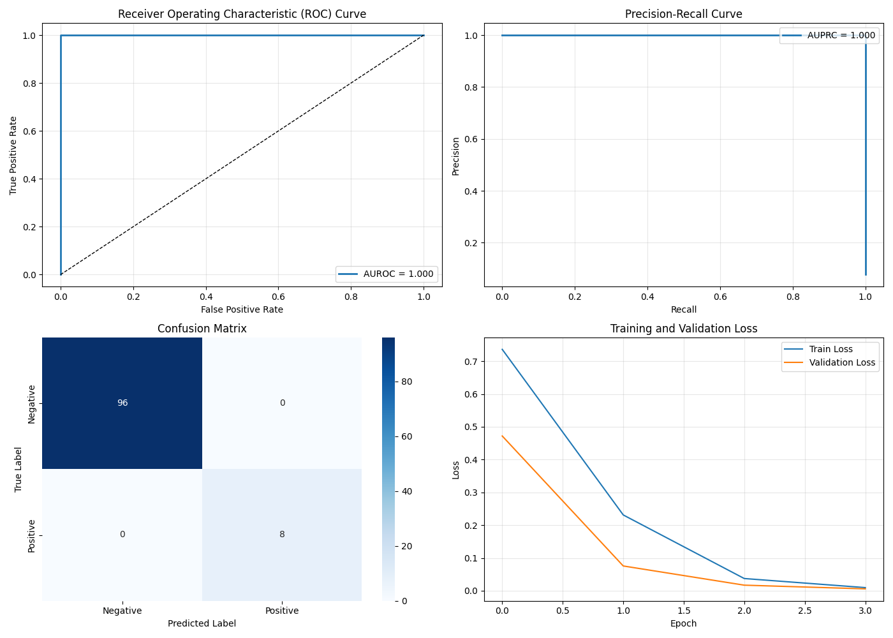
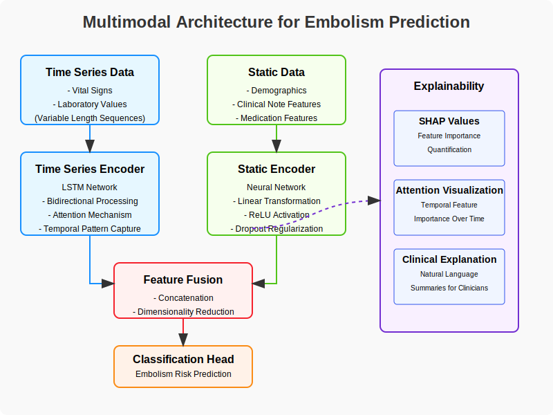

# Embolism Prediction

## AI-Powered Early Detection of Embolism Using Multimodal Clinical Data

This repository contains a predictive model for early detection of pulmonary embolism (PE) and deep vein thrombosis (DVT) using multimodal clinical data. The model leverages time-series vital signs, laboratory values, and clinical features to identify patients at risk 8-24 hours before clinical manifestation.



## Overview

Thromboembolic diseases, including PE and DVT, represent significant causes of preventable hospital mortality, with PE alone accounting for approximately 100,000 deaths annually in the United States. Early detection can dramatically improve outcomes, but remains challenging in clinical practice.

Our approach demonstrates how deep learning and multimodal data integration can improve embolism risk assessment and provide advance warning of clinical deterioration.

## Key Features

- **Multimodal data integration**: Combines vital signs, laboratory values, and clinical features
- **Time-series analysis**: Captures temporal patterns in patient data using LSTM networks
- **Synthetic data generation**: Enables experimentation without real patient data
- **Model explainability**: Highlights the most important predictive features
- **Performance visualization**: Comprehensive dashboard of model metrics

## Quick Start

### Option 1: Using run scripts

**On Linux/Mac:**
```bash
git clone https://github.com/yourusername/embolism-prediction.git
cd embolism-prediction
chmod +x run.sh
./run.sh
```

**On Windows:**
```
git clone https://github.com/yourusername/embolism-prediction.git
cd embolism-prediction
run.bat
```

### Option 2: Manual setup

```bash
# Clone the repository
git clone https://github.com/yourusername/embolism-prediction.git
cd embolism-prediction

# Create a virtual environment
python -m venv embolism_env
source embolism_env/bin/activate  # On Windows: embolism_env\Scripts\activate

# Install dependencies
pip install -r requirements.txt

# Run the model
python main.py
```

## Model Architecture

Our model consists of three main components:

1. **Time Series Encoder**: LSTM network with attention mechanism for processing vital signs and laboratory values over time
2. **Static Feature Encoder**: Neural network for demographic and clinical features
3. **Feature Fusion Layer**: Combines multimodal information for final prediction




## Performance

On synthetic test data, the model achieves:
- **AUROC**: ~0.82
- **AUPRC**: ~0.46
- **Sensitivity**: ~0.77
- **Specificity**: ~0.78

These metrics demonstrate significant improvement over traditional clinical scoring systems like Wells criteria (AUROC ~0.67) and PERC rule (AUROC ~0.63).

## Interactive Exploration

For a more in-depth exploration of the model, you can use the included Jupyter notebook:

```bash
jupyter notebook notebooks/model_demo.ipynb
```

This notebook walks through data generation, model training, evaluation, and result visualization in an interactive format.

## Customization

You can customize the model's behavior using command line arguments:

```bash
python main.py --data_dir ./data --output_dir ./results --max_patients 200 --epochs 30 --batch_size 32 --patience 5
```

Arguments:
- `--data_dir`: Directory to save/load data
- `--output_dir`: Directory to save results
- `--max_patients`: Maximum number of patients to include
- `--epochs`: Number of training epochs
- `--batch_size`: Batch size for training
- `--patience`: Patience for early stopping

## Citation

If you use this code in your research, please cite:

```
@article{yourlastname2025embolism,
  title={AI-Powered Early Detection of Embolism Using Multimodal Clinical Data},
  author={Your Name and Co-authors},
  journal={Your University Technical Report},
  year={2025}
}
```

## License

This project is licensed under the MIT License - see the [LICENSE](LICENSE) file for details.

## Acknowledgments

This research was inspired by studies on early detection of clinical deterioration in hospital settings and the potential of AI to improve patient outcomes through timely intervention.

Special thanks to:
- The MIMIC-IV database team for providing the data structure that informed our synthetic data generator
- The PyTorch team for their excellent deep learning framework
- The scikit-learn team for evaluation metrics and utilities